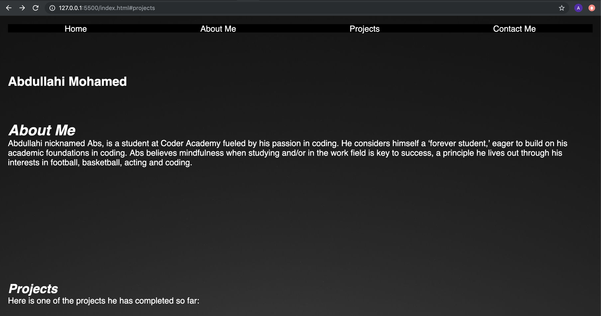
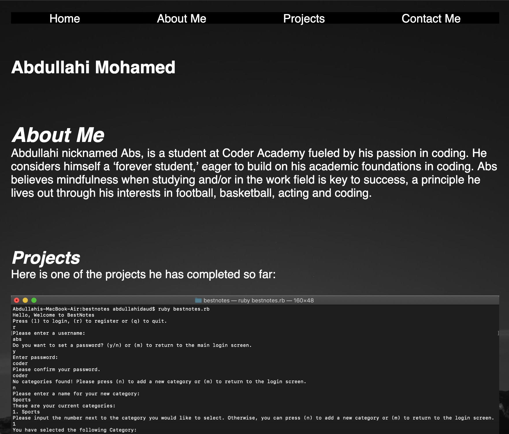
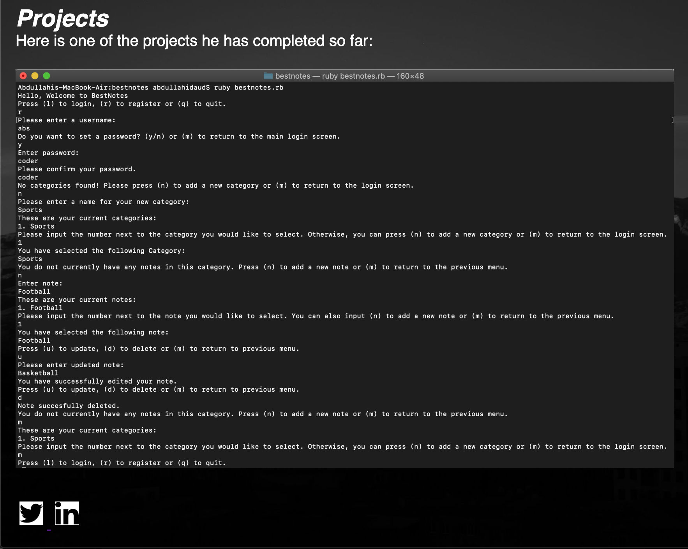
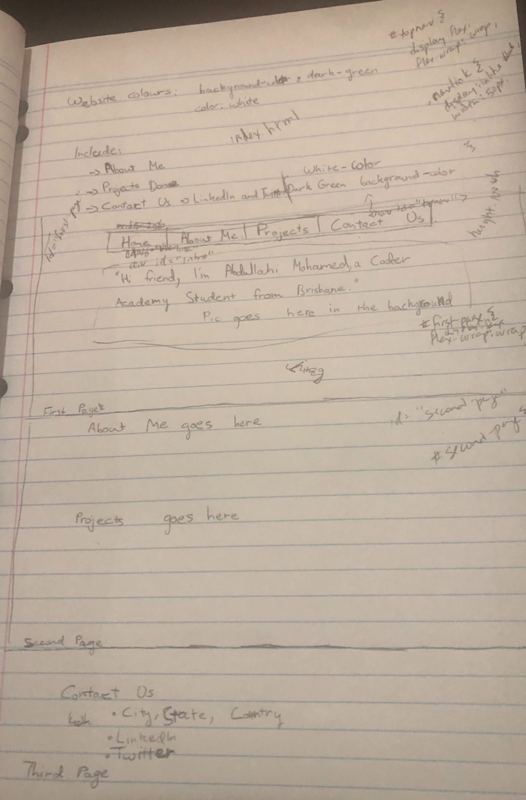
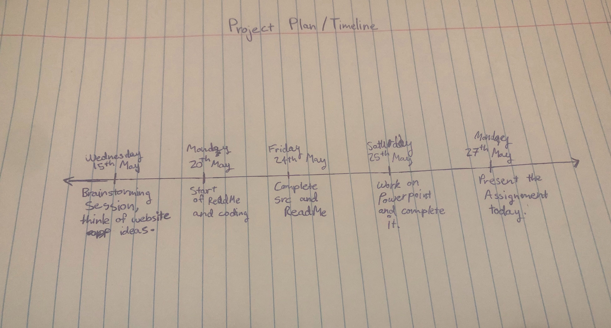
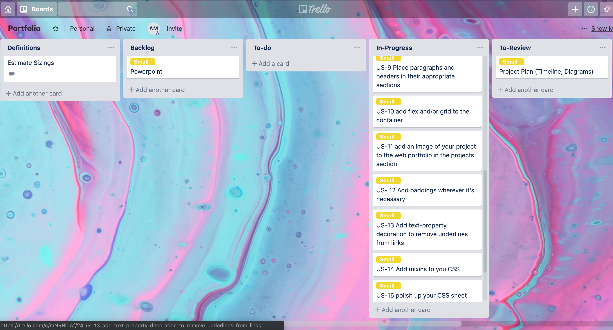
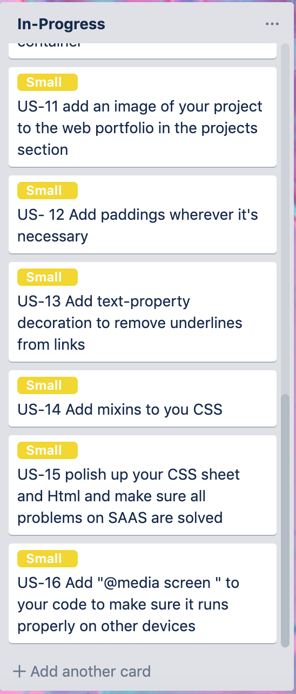

# Abs's Portfolio

## A link (URL) to your published portfolio website

## A link to your GitHub repository (Ensure the repository (repo) is accessible by your Educators)
https://github.com/absmohamed/My-Portfolio 

## Description of your portfolio website, including,
### Purpose:
The purpose of this assessment was to create a Portfolio website so that we can be seen, be heard, innovate, build credibility and build a following.
### Functionality / features:
- Once on the website, you can see my name displayed at the top.
- Above the name, there are nav-links that say 'Home', 'about me', 'projects' and 'Contact Us.' 
- The code is in a container, so it's essentially a one-page website.
- Underneath my name is the 'About Me' section.
- Underneath the About me section is the 'Projects' section.
- There is a screenshot of one of my completed projects, if you click on that screenshot, it will send you to its github repository.
- Underneath the screenshot, my Twitter and Linkedin accounts are displayed with their logos. If you click on the logos, it shall take you directly to my twitter and linkedin accounts.
-The website format stays consistent when you view it on a variety of devices.

### Screenshots:
Here are screenshots of my portfolio website on laptop mode: 

Here are screenshots of my portfolio website on tablet mode:

Here is a screenshot of my portfolio website on Iphone 6/7/8 mode:

### Target audience:
It's important to understand that only once you've defined your audience, you can create a portfolio that serves their needs. In my case, the target audience of my portfolio website was future companies that employ junior developers.
### Tech stack (e.g. html, css, deployment platform, etc):
The Technology that i've used for this assessment are:
- HTML:
HTML stands for Hypertext Markup Language, a system for tagging text files to get font, colour, hyperlink effects on Web pages and etc.
- CSS:
CSS stands for Cascading Style Sheets. CSS allows web developers to alter the layout and appearance of their webpages.
-Deployment Platform: Github
Github is a web-based hosting service for software development projects.

## Design documentation including, Design process:

### Details of planning process including, Project plan & timeline Screenshots of Trello board(s):
Here is my original portfolio design: 

It's similar to my final portfolio however there are major differences such as my original design has three pages while my final portfolio design is in a container, thus displaying one page

Here is my Project plan & Timeline:

Here is a link to my Trello board:
https://trello.com/b/RP2Kj7Te/portfolio

Here are screenshots of the Trello board:

## Short Answer Q&A
### Describe key events in the development of the internet from the 1980s to today (max. 150 words)
- The first network protocol which was invented in order to connect computers over the Advanced Research Projects Agency Network (ARPANET) was the Network Control Protocol. This network control protocol was replaced in 1983.

- In order to connect research centres that were not on ARPANET, the National Science foundation (NSF) created CSNET in 1979. 

- The Computer Science Network (CSNET) began operation in 1981 in the United States. 

- CSNET's incredible growth led to the creation of the National Science Foundation Network (NSFNET) in 1985.

- On the year 1990, ARPANET had ceased to exist and the National Science Foundation Network reached North-American and various European nations.

- In 1991, the use policy of the internet, was made larger in order to allow different companies to us it for commercial purposes.

- In the year 1995, the regional networks of the National Science Foundation network migrated to commercial providers.
The NSFNET ceased to exist.

- In 1993-1995 there was a significant growth of the early web.

### Define and describes the relationship between fundamental aspects of the internet such as: domains, web servers, DNS, and web browsers (max. 150 words)
- Domain: 
A domain is a substitute for the IP Address. Its purpose is to help people to find your web page with little to no effort.

- Web servers: 
Web servers are generally programs that use  HyperText Transfer Protocol (HTTP). They use HyperText Transfer Protocols in order to serve files that form web pages to users. 

- DNS:
DNS stands for Domain Name system. The DNS is the way that internet domain names are located and translated into IP addresses. 

- Web browsers:
A browser is a program that you'reusing right now to search for and explore web pages.

- The relationship between a domain and a web server is that they're both dependent on each other when hosting a website because the domain name is the address of the server. You can also use your IP address when hosting a server, however that would be unwise as people won't remember the IP address.

### Reflect on one aspect of the development of internet technologies and how it has contributed to the world today (max. 150 words)

When in 1991, the use policy of the internet, was made larger in order to allow different companies to use it for commercial purposes, this contributed massively to the world today. The internet widened in scope and encompasses research centers, universities, institutions and etc. The internet has facilitated growth within there respective fields, thuus contributing to the world today.